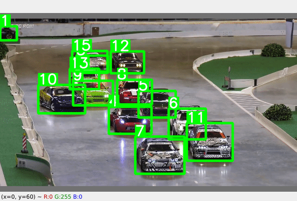

# <div align="center">Simple Object Tracking</div>

<div align="center">
<p>Multi-Object Tracking with YOLOv5 and Norfair tracker</p>
<p>
  
</p>
</div>

## Requirements

* torch >= 1.10.1
* torchvision >= 0.11.1

Other requirements can be installed with `pip install -r requirements.txt`.

Clone the repository recursively:

```bash
$ git clone --recursive git@github.com:1chimaruGin/SimpleTracker.git
```

Then download a YOLO model's weight from [YOLOv5](https://github.com/ultralytics/yolov5) and place it in `weights`.

## Tracking

You can change the class you want to track.
Check the class id [here](https://tech.amikelive.com/node-718/what-object-categories-labels-are-in-coco-dataset/).
```bash
$ python tracker.py --source /path/to/video --model weights/yolov5m6.pt --classes 0
```

## References

* https://github.com/ultralytics/yolov5
* https://github.com/sithu31296/simple-object-tracking
* https://github.com/tryolabs/norfair
## Citations

``` 
@software{joaquin_alori_2022_6471349,
  author       = {Joaquín Alori and
                  Alan Descoins and
                  KotaYuhara and
                  David and
                  facundo-lezama and
                  Braulio Ríos and
                  fatih and
                  shafu.eth and
                  Agustín Castro and
                  David Huh},
  title        = {tryolabs/norfair: v0.4.3},
  month        = apr,
  year         = 2022,
  publisher    = {Zenodo},
  version      = {v0.4.3},
  doi          = {10.5281/zenodo.6471349},
  url          = {https://doi.org/10.5281/zenodo.6471349}
}
```